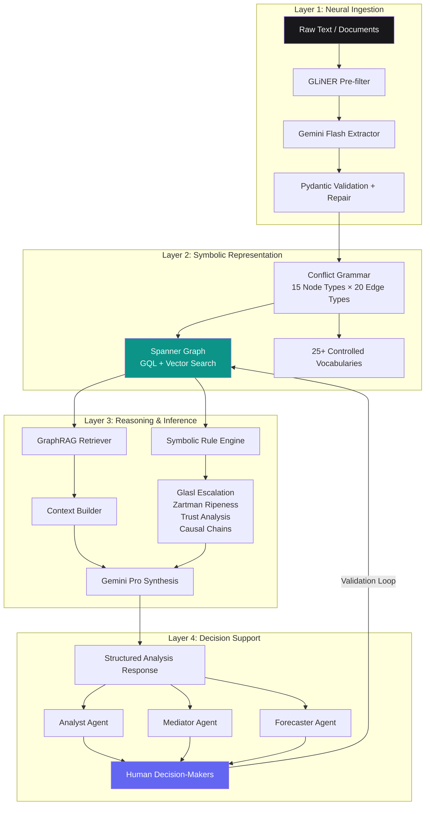

# DIALECTICA by TACITUS ◳

## The Universal Data Layer for Human Friction

[](LICENSE)
[](https://python.org)
[](https://nextjs.org)
[](https://cloud.google.com/spanner)

> *"We make conflict computable enough for better human judgment."*

DIALECTICA is a neurosymbolic conflict intelligence platform that structures any conflict — from interpersonal workplace disputes to geopolitical armed conflicts — into a computable knowledge graph. It serves as the universal data backbone for TACITUS products (CONCORDIA, PRAXIS, CiviSphere, Wind Tunnel) and as a developer API platform.

---

## Architecture



---

## Ontology Overview

DIALECTICA implements the **TACITUS Core Ontology v2.0** — the Conflict Grammar.

### 15 Node Types

| Node | Description | Tier |
|------|-------------|------|
| **Actor** | Any entity with agency (person, org, state, coalition) | Essential |
| **Conflict** | Sustained friction pattern with Glasl stage + Kriesberg phase | Essential |
| **Event** | Discrete occurrence (PLOVER 16-type coding) | Essential |
| **Issue** | Subject matter / incompatibility (what it's ABOUT) | Essential |
| **Interest** | Underlying need/fear (the WHY) — Fisher/Ury core | Essential |
| **Norm** | Rules, laws, contracts, policies | Standard |
| **Process** | ADR mechanisms (negotiation, mediation, arbitration) | Standard |
| **Outcome** | Results of processes | Standard |
| **Narrative** | Dominant/alternative/counter frames | Standard |
| **PowerDynamic** | French/Raven power bases with temporal versioning | Standard |
| **EmotionalState** | Plutchik 8-primary emotions with dyads | Full |
| **TrustState** | Mayer/Davis/Schoorman ability × benevolence × integrity | Full |
| **Location** | Hierarchical geography (ACLED/UCDP spatial coding) | Full |
| **Evidence** | Supporting material with reliability scores | Full |
| **Role** | Contextual role reification (claimant, mediator, etc.) | Full |

### 20 Edge Types

`PARTY_TO` · `PARTICIPATES_IN` · `HAS_INTEREST` · `PART_OF` · `CAUSED` · `AT_LOCATION` · `WITHIN` · `GOVERNED_BY` · `VIOLATES` · `RESOLVED_THROUGH` · `PRODUCES` · `ALLIED_WITH` · `OPPOSED_TO` · `HAS_POWER_OVER` · `MEMBER_OF` · `EXPERIENCES` · `TRUSTS` · `PROMOTES` · `ABOUT` · `EVIDENCED_BY`

### 25+ Controlled Vocabularies

`ActorType` · `ConflictScale` · `ConflictDomain` · `ConflictStatus` · `KriesbergPhase` · `GlaslStage` · `GlaslLevel` · `Incompatibility` · `ViolenceType` · `Intensity` · `EventType` · `EventMode` · `EventContext` · `QuadClass` · `InterestType` · `NormType` · `Enforceability` · `ProcessType` · `ResolutionApproach` · `ProcessStatus` · `OutcomeType` · `Durability` · `PrimaryEmotion` · `EmotionIntensity` · `NarrativeType` · `ConflictMode` · `PowerDomain` · `RoleType`

---

## Tier Comparison

| Feature | Essential | Standard | Full |
|---------|-----------|----------|------|
| Node Types | 5 | 10 | 15 |
| Edge Types | 7 | 14 | 20 |
| Theory Frameworks | 1 | 6 | 15 |
| Max Nodes/Workspace | 1,000 | 5,000 | Unlimited |
| Basic Extraction | ✓ | ✓ | ✓ |
| Timeline | ✓ | ✓ | ✓ |
| Actor Network | ✓ | ✓ | ✓ |
| Theory Assessment | — | ✓ | ✓ |
| Escalation Tracking | — | ✓ | ✓ |
| Power Analysis | — | ✓ | ✓ |
| Narrative Mapping | — | ✓ | ✓ |
| Emotion Tracking | — | — | ✓ |
| Trust Modeling | — | — | ✓ |
| Causal Analysis | — | — | ✓ |
| PLOVER Compatibility | — | — | ✓ |
| ACLED Compatibility | — | — | ✓ |
| Evidence Management | — | — | ✓ |

---

## Quick Start

### Prerequisites
- Docker & Docker Compose
- GCP account (for production deployment)

### Local Development

```bash
# Clone repository
git clone https://github.com/tacitus/dialectica.git
cd dialectica

# Copy environment variables
cp .env.example .env
# Edit .env with your GCP project ID and credentials

# Start all services (Spanner emulator + API + Web)
docker-compose up

# API available at http://localhost:8080
# Web app available at http://localhost:3000
# Spanner emulator at localhost:9010
```

### Seed Sample Data

```bash
# Initialize Spanner schema
make seed-schema

# Load theory frameworks
make seed-frameworks

# Load JCPOA sample conflict graph
make seed-samples

# Create admin API key
make create-admin-key
```

### Run Tests

```bash
make test
```

---

## API Overview

### Authentication
All requests require `X-API-Key` header or `Authorization: Bearer {key}`.

### Key Endpoints

```
POST   /extract/text              Extract conflict entities from raw text
POST   /extract/document          Upload PDF/DOCX for extraction
POST   /ask                       Natural language query → structured analysis
POST   /analyze/{workspace_id}    Full multi-theory conflict analysis
POST   /mediate/{workspace_id}    Mediation strategy brief
GET    /graph/traverse/{id}       N-hop graph traversal
POST   /graph/search              Hybrid vector + keyword search
GET    /theory/frameworks         List all 15 theory frameworks
POST   /theory/assess             Run theory assessment on workspace
GET    /workspaces                List workspaces with Glasl stages
POST   /workspaces                Create new conflict workspace
```

### Example: Extract from Text

```bash
curl -X POST https://api.dialectica.tacitus.ai/extract/text \
  -H "X-API-Key: your-key" \
  -H "Content-Type: application/json" \
  -d '{
    "text": "Iran and the P5+1 nations reached agreement on uranium enrichment limits...",
    "workspace_id": "ws_jcpoa_2015",
    "tier": "full"
  }'
```

### Example: Ask a Question

```bash
curl -X POST https://api.dialectica.tacitus.ai/ask \
  -H "X-API-Key: your-key" \
  -d '{
    "query": "What are the key trust deficits between Iran and the US, and how do they affect ripeness for negotiation?",
    "workspace_id": "ws_jcpoa_2015"
  }'
```

---

## Database Options

### Primary: Google Cloud Spanner Graph (Recommended)
- **Unified engine**: graph (GQL) + relational (SQL) + vector search in one system
- **Dynamic labels**: All 15 node types in one `Nodes` table
- **Native vector search**: 768-dim embeddings for semantic retrieval
- **GQL (ISO standard)**: `MATCH (a:actor)-[e:party_to]->(c:conflict) RETURN a, e, c`
- **99.999% availability**, global consistency, automatic sharding
- **Cost**: ~$90-157/month at startup scale (100 Processing Units)

### Secondary: Neo4j Aura on GCP
- **Cypher** query language (widely known)
- **65+ graph algorithms** via Graph Data Science (community detection, PageRank, centrality)
- **Native vector search** (since Neo4j 5.11)
- Use when graph algorithms are required
- **Cost**: $65-146/month on GCP Marketplace

### Compatible: FalkorDB
- **OpenCypher** compatible with existing TACITUS pipeline code
- **GraphBLAS** performance (<1ms simple traversals)
- Self-hosted option on Cloud Run (~$20-30/month)
- Suitable for development and testing

The `GraphClient` interface makes backends swappable — configure via `GRAPH_BACKEND` env var.

---

## Technology Stack

**Backend**
- Python 3.12+, FastAPI, Pydantic v2
- Google Cloud Spanner Graph (primary database)
- Vertex AI Gemini 2.5 Flash/Pro (extraction + reasoning)
- Vertex AI text-embedding-005 (768-dim semantic embeddings)
- GLiNER (pre-filtering NER)
- LangGraph (extraction + reasoning pipelines)
- Pub/Sub (async extraction jobs)

**Frontend**
- Next.js 15, React 19, TypeScript
- Tailwind CSS, shadcn/ui
- D3.js (force-directed conflict graphs)
- Recharts (analytics dashboards)

**Infrastructure**
- Google Cloud Run (API + Web)
- Cloud Storage (document storage)
- Secret Manager (API keys)
- Artifact Registry (Docker images)
- Terraform (IaC)

**Theoretical Grounding (30+ frameworks)**
- Negotiation: Fisher/Ury, Ury/Brett/Goldberg, Malhotra/Bazerman
- Conflict: Glasl (9-stage), Kriesberg (7-phase), Galtung (ABC triangle), Lederach, Deutsch
- Psychology: Plutchik (emotion wheel), Mayer/Davis/Schoorman (trust), Thomas-Kilmann
- Computational: PLOVER, CAMEO, ACLED, UCDP event coding
- Narrative: Winslade/Monk, Cobb, Dewulf
- Power: French/Raven, Ury/Brett/Goldberg
- Causality: Pearl (do-calculus)

---

## Repository Structure

```
dialectica/
├── packages/
│   ├── ontology/      # Core Conflict Grammar (enums, primitives, relationships, theories)
│   ├── graph/         # Database abstraction (Spanner + Neo4j clients)
│   ├── extraction/    # LangGraph extraction pipeline + Gemini integration
│   ├── reasoning/     # GraphRAG + symbolic rule engine + AI agents
│   └── api/           # FastAPI service with all routers
├── apps/
│   └── web/           # Next.js 15 admin + analyst interface
├── infrastructure/
│   ├── terraform/     # GCP infrastructure as code
│   └── scripts/       # Setup and seed scripts
├── data/seed/         # Framework definitions, sample conflict graphs
└── docs/              # Architecture, ontology, deployment guides
```

---

## License

Apache 2.0 — see [LICENSE](LICENSE)

---

*DIALECTICA by TACITUS ◳ — The Universal Data Layer for Human Friction*

*"We make conflict computable enough for better human judgment."*
