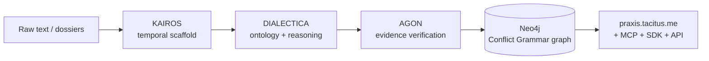
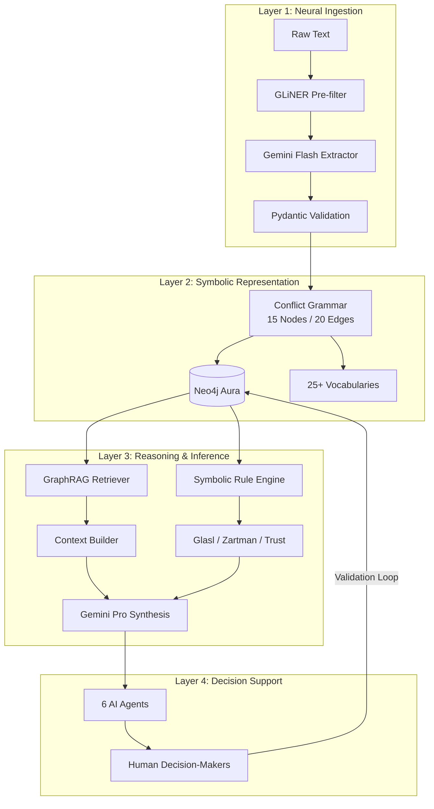

# DIALECTICA by TACITUS

### The reasoning core of the TACITUS neurosymbolic stack for conflict intelligence.

[](https://github.com/sargonxg/A2_DIALECTICAbyTACITUS/actions)
[](LICENSE)
[](#status--how-to-engage)
[](https://python.org)
[](https://neo4j.com/cloud/aura/)

> ⚠️ **Experimental work in progress.** Live MVP, active development, breaking changes possible.
> Built in the open by [TACITUS](https://www.tacitus.me). **Feedback, issues, and PRs welcome** — see [Status & how to engage](#status--how-to-engage).

> *"We make conflict computable enough for better human judgment."*

DIALECTICA structures any conflict — from workplace disputes to geopolitical war — into a computable knowledge graph grounded in 30+ academic frameworks. It is the conductor of the TACITUS stack and the backbone for [praxis.tacitus.me](https://praxis.tacitus.me).

---

## The TACITUS Trinity

DIALECTICA does not stand alone. It is the reasoning core of a three-service stack. Each repo is independently publishable; together they cover the full neurosymbolic surface.

| Repo | Role | Language | Owns |
|---|---|---|---|
| **DIALECTICA** (this repo) | Reasoning core + conductor | Python | Conflict Grammar ontology, Neo4j graph, 6 agents, GraphRAG, FastAPI, MCP server |
| [**AGON**](https://github.com/sargonxg/AGON) | Evidence engine | Rust | Claim verification, contradictions, friction maps, deterministic inference |
| [**KAIROS**](https://github.com/sargonxg/KAIROS-temporal-vision-TACITUS) | Temporal engine | Rust | Date extraction, Allen-13 relations, commitment state, episode boundaries |


```mermaid
flowchart LR
    SRC[Raw text / dossiers] --> K[KAIROS<br/>temporal scaffold]
    K --> D[DIALECTICA<br/>ontology + reasoning]
    D --> A[AGON<br/>evidence verification]
    A --> G[(Neo4j<br/>Conflict Grammar graph)]
    G --> PR[praxis.tacitus.me<br/>+ MCP + SDK + API]
```

**Why split:** Rust at the edges for deterministic, fast structural work. Python in the middle for orchestration + LLM reasoning. **Why combine:** each repo fills a gap the others can't — temporal richness (KAIROS), evidence-bound claims (AGON), ontology + reasoning (DIALECTICA).

📖 **Integration docs:** [`docs/integration/`](docs/integration/) — architecture, contracts, ontology mapping, roadmap, PRAXIS backbone.

---

## What you get

- **Conflict Grammar ontology** — 15 node types, 20 edge types, 25+ controlled vocabularies, 6 subdomains (geopolitical, workplace, commercial, legal, armed, environmental)
- **25+ deterministic symbolic rules** — Glasl escalation, Zartman ripeness, Mayer trust, French/Raven power, causal chains
- **6 AI agents** — Analyst, Advisor, Comparator, Forecaster, Mediator, Theorist
- **GraphRAG retrieval** — hybrid vector + graph + temporal + reciprocal rank fusion
- **15 theory frameworks** — Fisher/Ury, Thomas-Kilmann, Glasl, Galtung, Lederach, and more
- **LangGraph extraction pipeline** — 10-step DAG with Gemini 2.5 Flash + optional GLiNER NER
- **Multi-database** — Neo4j Aura (primary), FalkorDB, Spanner
- **TACITUS Integration API** — `/v1/integration/*` for other TACITUS apps (PRAXIS, Trust Graph, Wind Tunnel)
- **MCP server** — 5 tools for Claude Desktop (becoming 9 with trinity wiring)
- **Live ingestion** — Project Gutenberg + upload + paste with SSE progress + auto-reasoning
- **630+ tests** across 4 Python packages

---

## Quick Start

```bash
git clone https://github.com/sargonxg/A2_DIALECTICAbyTACITUS.git
cd A2_DIALECTICAbyTACITUS
cp .env.example .env

# Bring up Neo4j + Redis + API
make dev-local

# Seed 6 conflict scenarios (114 nodes, 126 edges)
make seed

# Verify
curl http://localhost:8080/health
curl -H "X-API-Key: dev-admin-key-local" http://localhost:8080/v1/workspaces
```

| Service | URL |
|---|---|
| API | http://localhost:8080 (Swagger at `/docs`) |
| Neo4j Browser | http://localhost:7474 (`neo4j` / `dialectica-dev`) |
| Frontend | `cd apps/web && npm install && npm run dev` → http://localhost:3000 |

**See [`docs/local-development.md`](docs/local-development.md) for non-Docker setup, CLI usage, and the optional graph-reasoning subsystem.**

---

## Architecture (DIALECTICA-internal)

DIALECTICA's four-layer neurosymbolic stack:


```mermaid
graph TB
    subgraph "Layer 1: Neural Ingestion"
        A[Raw Text] --> B[GLiNER Pre-filter]
        B --> C[Gemini Flash Extractor]
        C --> D[Pydantic Validation]
    end

    subgraph "Layer 2: Symbolic Representation"
        D --> E[Conflict Grammar<br/>15 Nodes / 20 Edges]
        E --> F[(Neo4j Aura)]
        E --> G[25+ Vocabularies]
    end

    subgraph "Layer 3: Reasoning & Inference"
        F --> H[GraphRAG Retriever]
        F --> I[Symbolic Rule Engine]
        H --> J[Context Builder]
        I --> K[Glasl / Zartman / Trust]
        J --> L[Gemini Pro Synthesis]
        K --> L
    end

    subgraph "Layer 4: Decision Support"
        L --> M[6 AI Agents]
        M --> N[Human Decision-Makers]
        N -->|Validation Loop| F
    end
```

**Critical invariant:** deterministic symbolic conclusions never overridden by probabilistic neural predictions. Enforced via `confidence_type` tagging.

📖 **Deep architecture:** [`docs/ARCHITECTURE.md`](docs/ARCHITECTURE.md)
📖 **Neurosymbolic rationale:** [`docs/neurosymbolic-rationale.md`](docs/neurosymbolic-rationale.md)
📖 **Trinity integration architecture:** [`docs/integration/ARCHITECTURE.md`](docs/integration/ARCHITECTURE.md)

---

## API surface

| Group | Endpoint pattern | Purpose |
|---|---|---|
| Health | `/health`, `/health/live`, `/health/ready` | Probes |
| Workspaces | `/v1/workspaces` | CRUD |
| Ingestion | `/v1/workspaces/{id}/ingest/*`, `/v1/gutenberg/catalog` | Document intake + Gutenberg corpus |
| Extraction | `/v1/workspaces/{id}/extract`, `/extractions/{id}/stream` (SSE) | Pipeline + progress |
| Graph | `/v1/workspaces/{id}/graph`, `/graph/subgraph` | Read graph |
| Reasoning | `/v1/workspaces/{id}/analyze`, `/reasoning` | Symbolic + agent reasoning |
| Theory | `/v1/theory/frameworks`, `/v1/theory/match` | 15 frameworks |
| **Integration** | `/v1/integration/graph`, `/context`, `/query` | **For other TACITUS products (PRAXIS, Trust Graph)** |
| Admin | `/v1/admin/*` | Benchmarks, usage, system info |

**Coming with trinity wiring:**
- `/v1/temporal/*` — proxies KAIROS for external developers
- `/v1/evidence/*` — proxies AGON

📖 **API reference:** [`docs/api-reference.md`](docs/api-reference.md)
📖 **SDK quickstart:** [`docs/sdk-quickstart.md`](docs/sdk-quickstart.md)

---

## Deployment

One-command Cloud Run deploy:

```bash
# Store Neo4j Aura creds in Secret Manager
make setup-secrets

# Deploy
bash infrastructure/scripts/deploy-cloudrun.sh YOUR_GCP_PROJECT_ID us-central1

# Frontend
cd apps/web && vercel --prod
```

📖 **Full deployment guide:** [`docs/deployment.md`](docs/deployment.md)
📖 **Production runbook:** [`docs/runbook.md`](docs/runbook.md)
📖 **GCP cost & cleanup:** [`docs/GCP_COST_CLEANUP.md`](docs/GCP_COST_CLEANUP.md)

---

## Repository layout (high-level)

```
A2_DIALECTICAbyTACITUS/
├── packages/
│   ├── ontology/          # Conflict Grammar (15 nodes, 20 edges, 25+ vocabularies, 15 theories, 25+ symbolic rules)
│   ├── graph/             # Database abstraction (Neo4j, FalkorDB, Spanner)
│   ├── extraction/        # LangGraph pipeline + Gemini + GLiNER + source loaders
│   ├── reasoning/         # GraphRAG + symbolic rule engine + 6 agents + KGE
│   ├── api/               # FastAPI (14 routers, auth, multi-tenant)
│   ├── mcp/               # MCP server for Claude Desktop (5 tools today, 9 with trinity)
│   ├── sdk-typescript/    # @tacitus/dialectica-sdk
│   └── integrations/      # [planned] KAIROS + AGON clients (see docs/integration/)
├── apps/web/              # Next.js 15 frontend
├── infrastructure/        # Terraform + deploy scripts
├── data/seed/             # 6 sample conflicts + benchmark corpora
└── docs/
    ├── integration/       # ★ Trinity integration docs (architecture, contracts, mapping, roadmap)
    ├── ARCHITECTURE.md
    ├── api-reference.md
    ├── deployment.md
    └── ...
```

---

## Testing

```bash
make test              # all Python tests (630+)
make test-ontology     # 452 tests, 82% coverage
make test-api          # 72 tests
make test-extraction   # 75 tests
make test-reasoning    # 29 tests
make test-e2e          # Playwright (frontend running)
make quality-all       # lint + typecheck + tsc + web-lint
```

📖 **Benchmarking:** [`docs/benchmarking.md`](docs/benchmarking.md) — 4 gold-standard corpora (JCPOA, Romeo/Juliet, Crime/Punishment, War/Peace), 35+ benchmark questions

---

## MCP Server (Claude Desktop)

Today: 5 tools — `query_conflict_graph`, `get_actor_analysis`, `get_escalation_status`, `compare_conflicts`, `ingest_document`.

With trinity wiring (planned): +4 tools — `temporal_query` (KAIROS), `verify_claim` (AGON), `find_contradictions` (AGON), `commitment_state` (KAIROS).

📖 **Setup:** [`docs/mcp-setup.md`](docs/mcp-setup.md)

---

## Tech Stack

| Layer | Tech |
|---|---|
| Language | Python 3.12+, TypeScript |
| Package manager | UV (Python), npm (TS) |
| API | FastAPI, async, OpenAPI |
| Graph DB | Neo4j Aura (primary), FalkorDB, Spanner |
| Vector | Qdrant (768d + 256d named vectors) |
| LLM | Gemini 2.5 Flash + Pro (Vertex AI) |
| NER (optional) | GLiNER |
| Pipeline | LangGraph (10-step DAG) |
| Frontend | Next.js 15, React 19, Tailwind, D3.js |
| Deploy | Cloud Run + Vercel |
| CI/CD | GitHub Actions, Cloud Build |
| Analytics | BigQuery (optional) |
| Advanced ML | Databricks (optional, for KGE training) |

---

## Honest capabilities

What DIALECTICA does well today:
- Structured extraction of actors, events, conflicts, commitments from text
- Deterministic reasoning over the graph (escalation stage, ripeness, trust analysis)
- Multi-tenant API with audit ledger
- Multi-database backend

What it does NOT do today:
- It does not produce verdicts. It produces structured intelligence.
- Single-document focus per ingestion job. Cross-document corpus reasoning is workspace-level, not automatic.
- Claim verification is currently best-effort via Gemini. Deterministic verification arrives with AGON wiring (see [`docs/integration/`](docs/integration/)).
- Temporal reasoning is timestamp-based, not Allen-interval. Arrives with KAIROS wiring.

If those last two matter for your use case, follow the integration roadmap.

---

## Status & how to engage

DIALECTICA is **experimental work in progress**. The live system runs, tests pass, deploys ship — but the API surface, ontology, and integration contracts are still evolving. Treat the codebase as a serious prototype, not a stabilized product.

**Comments welcome — preferred channels:**
- 💬 **[GitHub Discussions](https://github.com/sargonxg/A2_DIALECTICAbyTACITUS/discussions)** — ideas, questions, what to build next
- 🐛 **[Issues](https://github.com/sargonxg/A2_DIALECTICAbyTACITUS/issues)** — bugs, concrete proposals
- 📬 **[tacitus.me](https://www.tacitus.me)** — for direct contact or partnership conversations
- 🔀 **PRs** — happy to review; touch the integration contracts in [`docs/integration/`](docs/integration/) before large changes

If you're trying it on real data, I'd genuinely like to hear what broke and what surprised you.

## Contributing

```bash
git checkout -b feat/your-feature
# conventional commits: feat:, fix:, refactor:, docs:, test:, infra:
make quality-all  # must pass
```

📖 See [`CHANGELOG.md`](CHANGELOG.md) for release history.

---

## License

Apache 2.0 — see [LICENSE](LICENSE).

---

## TACITUS

Tools for institutions that need clearer judgment under pressure. [tacitus.me](https://www.tacitus.me).

```text
DIALECTICA — reasoning core
AGON       — evidence engine
KAIROS     — temporal engine
PRAXIS     — conflict intelligence SaaS (the cockpit)
CONCORDIA  — voice-first conflict mediation
```

*Making conflict computable enough for better human judgment.*
