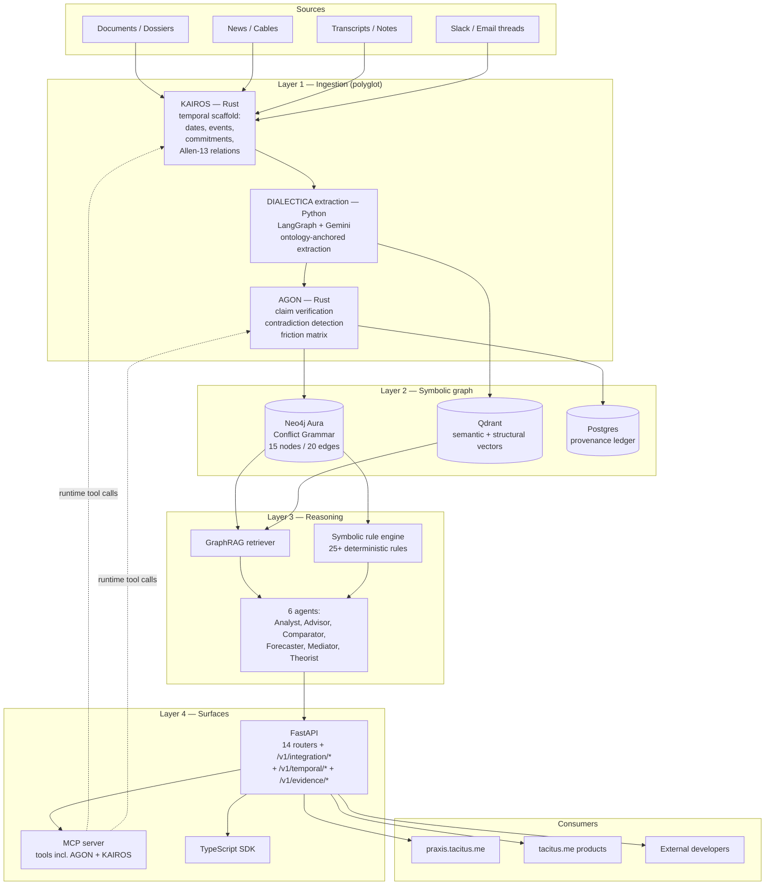

# Trinity Architecture

How DIALECTICA, AGON, and KAIROS combine into one stack.

> **Reality check.** This document describes the **target** architecture. Today, each repo runs independently. Wiring proceeds in feature-flagged slices — see [`ROADMAP.md`](./ROADMAP.md).

---

## System diagram



---

## Data flow — one document end to end

```
1. POST /v1/workspaces/{id}/ingest
   payload = { source, text, metadata }
        │
        ▼
2. DIALECTICA pipeline_runner.run_pipeline_with_progress()
   step 1: KAIROS pre-pass        ← feature flag EXTRACTION_USE_KAIROS
     → POST kairos:/api/v1/analyze
     ← returns { dates, events, actors, commitments, episodes, relations }
     emit SSE: "temporal_scaffold_complete"
        │
        ▼
   step 2-N: LangGraph 10-step DAG (existing)
     receives KAIROS scaffold as "anchored context"
     Gemini extraction now operates over typed events, not raw blob
     emit SSE per step
        │
        ▼
   step N+1: AGON post-pass        ← feature flag EXTRACTION_USE_AGON
     → POST agon:/api/perceive
     ← returns { claims (verified/unresolved), contradictions, friction, quality_gates }
     emit SSE: "evidence_verified"
        │
        ▼
   step N+2: ontology fusion (existing)
     maps KAIROS events → Conflict Grammar Event nodes
     maps AGON claims → Assertion nodes with EVIDENCED_BY edges
     maps AGON contradictions → CONTRADICTS edges
     maps KAIROS commitments → Commitment nodes with state vocabulary
     writes to Neo4j (+ Qdrant for vectors, + Postgres for ledger)
        │
        ▼
   step N+3: auto-reasoning (existing)
     symbolic rules fire over enriched graph
     attach summary to job
        │
        ▼
   final SSE: "job_complete" with graph stats + reasoning summary
```

---

## Service topology

```
                    ┌─────────────────────────┐
                    │   Vercel (Next.js 15)   │
                    │  praxis.tacitus.me +    │
                    │  dialectica.tacitus.me  │
                    └────────────┬────────────┘
                                 │ HTTPS
                                 ▼
                    ┌─────────────────────────┐
                    │  Cloud Run: DIALECTICA  │
                    │  FastAPI gateway        │
                    │  api.dialectica.tacitus │
                    └──┬──────────┬───────┬───┘
                       │          │       │
              ┌────────┘          │       └──────────┐
              ▼                   ▼                   ▼
   ┌──────────────────┐  ┌─────────────────┐  ┌──────────────────┐
   │ Cloud Run: KAIROS│  │ Cloud Run: AGON │  │   Neo4j Aura     │
   │  Rust + Axum     │  │  Rust + Axum    │  │   primary graph  │
   │  kairos-server   │  │  agon-server    │  └──────────────────┘
   └──────────────────┘  └─────────────────┘
              │                   │
              ▼                   ▼
   ┌──────────────────┐  ┌─────────────────┐
   │ Gemini (Vertex)  │  │ Cloud SQL       │
   │ optional         │  │ AGON sessions   │
   └──────────────────┘  └─────────────────┘

  Also: Qdrant (vectors), Redis (rate limit), Pub/Sub (async), GCS (artifacts)
```

All three services deploy independently. DIALECTICA holds the public API contract.

---

## Failure modes (graceful degradation required)

| Scenario | Behavior |
|---|---|
| KAIROS down | Skip pre-pass. Run Gemini extraction on raw text. Emit SSE warning. Graph lacks Allen relations but is otherwise complete. |
| AGON down | Skip post-pass. Mark claims as `verification_status: skipped`. No contradiction edges added. SSE warning. |
| Both down | Pipeline behaves exactly as it does today. Zero regression. |
| Neo4j down | Hard failure (existing behavior). |
| Gemini down | Existing fallback path (keyword extraction). |

**Rule:** DIALECTICA must never block on AGON/KAIROS availability. They are enrichments, not dependencies.

Timeouts:
- KAIROS pre-pass: 30s soft, 60s hard. On timeout → skip, log, continue.
- AGON post-pass: 30s soft, 60s hard. Same.

---

## Identity and span discipline

The single hardest correctness problem. See [`CONTRACTS.md`](./CONTRACTS.md) for the spec. Summary:

- **One `document_id` per ingested text** (DIALECTICA mints, UUID v7).
- **Every span is `{document_id, char_start, char_end, sha256}`** across all three services.
- **Actor canonicalization is DIALECTICA's job** (it owns the workspace registry). KAIROS + AGON return their actor IDs; DIALECTICA resolves to canonical IDs at fusion time.
- **Event canonicalization is KAIROS's job** (it owns the temporal vocabulary). DIALECTICA preserves KAIROS event IDs as foreign keys.
- **Claim canonicalization is AGON's job** (it owns the verification status). DIALECTICA preserves AGON claim IDs.

Without this, fusion produces inconsistent graphs. With it, every node in the graph traces back to a verifiable span in a verifiable document.

---

## Why polyglot is right (not accidental)

| Concern | Rust (AGON, KAIROS) | Python (DIALECTICA) |
|---|---|---|
| Deterministic span checking, hashing, alias resolution | ✅ Fast, no GIL | ❌ Slower, harder to parallelize |
| LangGraph orchestration, agent loops, async I/O | ❌ Heavier infra | ✅ Native ecosystem |
| LLM integration, Pydantic validation, FastAPI | ❌ Less mature | ✅ Best-in-class |
| Allen-13 relations, interval algebra, evidence spans | ✅ Type system enforces correctness | ❌ Easy to drift |
| Workspace state, tenant isolation, billing | ❌ More boilerplate | ✅ Mature patterns |

**Conclusion:** Each service owns what it's best at. Cost: contract maintenance. Worth it.

---

## Versioning

Three services, one contracts package, semver everywhere.

- `tacitus-contracts` is published as:
  - Rust crate `tacitus-contracts` (Cargo)
  - Python package `tacitus-contracts` (PyPI)
  - npm package `@tacitus/contracts` (npm)
- Generated from `tacitus-contracts/schema/*.proto` (or JSON Schema — TBD, see [`CONTRACTS.md`](./CONTRACTS.md) §Tooling).
- Each service declares compatibility range in its manifest.
- DIALECTICA's `/health` endpoint exposes the contracts version it speaks; clients check.

Breaking change protocol:
1. Open RFC issue in `tacitus-contracts` repo (or `dialectica/docs/integration/rfcs/` until contracts repo exists).
2. All three repos comment.
3. Major bump + migration guide in `CONTRACTS.md`.

---

## Observability

- **Tracing:** OpenTelemetry. DIALECTICA generates `trace_id` per ingestion job, propagates to KAIROS + AGON via `X-Trace-Id` header.
- **Metrics:** each service exposes `/metrics` (Prometheus). DIALECTICA gateway aggregates.
- **Logs:** structured JSON, `trace_id` + `workspace_id` + `document_id` on every line.
- **SSE progress:** existing DIALECTICA stream extended with `kairos.*` and `agon.*` event types.

---

## Security boundaries

- **Public:** `praxis.tacitus.me`, `/health`, `/docs`, `/v1/waitlist`.
- **API key:** all `/v1/*` endpoints (existing).
- **Internal:** KAIROS + AGON Cloud Run services accept traffic only from DIALECTICA service account (IAM-bound). Not internet-exposed unless their own demo workbench is intentionally public.
- **Secrets:** all in GCP Secret Manager. Gemini API keys never logged. AGON request-scoped keys are not persisted (mirrors AGON's current posture).

---

*Continue with [`CONTRACTS.md`](./CONTRACTS.md) — the most important doc in this folder.*
